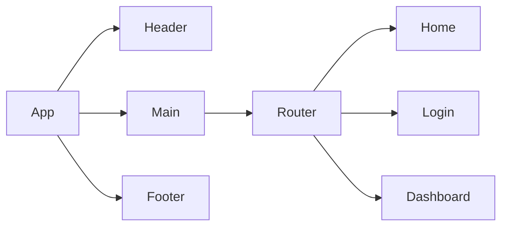

# Product Requirements Documentation

**Summary**
| Field | Detail |
|-------|--------|
| Project Name | Shifty|
| Description | An application to make shift coverage between nurses much more efficient. |
| Developers | Javier Delgado, Kyle Canamar |
| Live Website | TBD |
| Repo | https://github.com/Vanillajaviscript/shifty-backend |

## Problem Being Solved and Target Market

This application serves to replace the inefficent method of using the Facebook group modality to converse between nurses to trade shifts and make announcements. This application will tailored for healthcare professionals, namely NICU RNs. 

## User Stories

List of stories users should experience when using your application.

- Users should be able to see the site on desktop and mobile
- Users can create an account
- Users can sign in to their account
- Users can create a new post
- Users can see all their items on the dashboard
- Users can update posts
- User can delete posts
- User can comment on posts
- User can see main schedule

## Route Tables

For backend Applications you'll want to detail the different routes and types of your request your server can receive. There are three main things to define.

- The endpoint: the URL to which the request must be made
- The method: the type of http method the request should be
- The response: what the response should be, a web page, json data, etc.

You should also include any additional notes on any special headers that may be used and so forth.

| Endpoint | Method | Response | Other |
| -------- | ------ | -------- | ----- |
| /item | GET | JSON of all items | |
| /item | POST | Create new item return JSON of new item | body must include data for new item |
| /item/:id | GET | JSON of item with matching id number | |
| /item/:id | PUT | update item with matching idea, return its JSON | body must include updated data |
| /item/:id | DELETE | delete the item with the matching id | |
| /auth/signup | POST | creates new user account returns user JSON | new user info must be included in body |
| /auth/login | POST | logs in user and returns user JSON with JWT token | username and password must be included in body |
## Component Architecture

You can use the [Mermaid Markdown Syntax](https://mermaid-js.github.io/mermaid/#/flowchart) to create a chart of how the parts of your frontend website relate to each other. Units should represent components of your page. The following is an example you may see in a Single Page Application like a React App.

